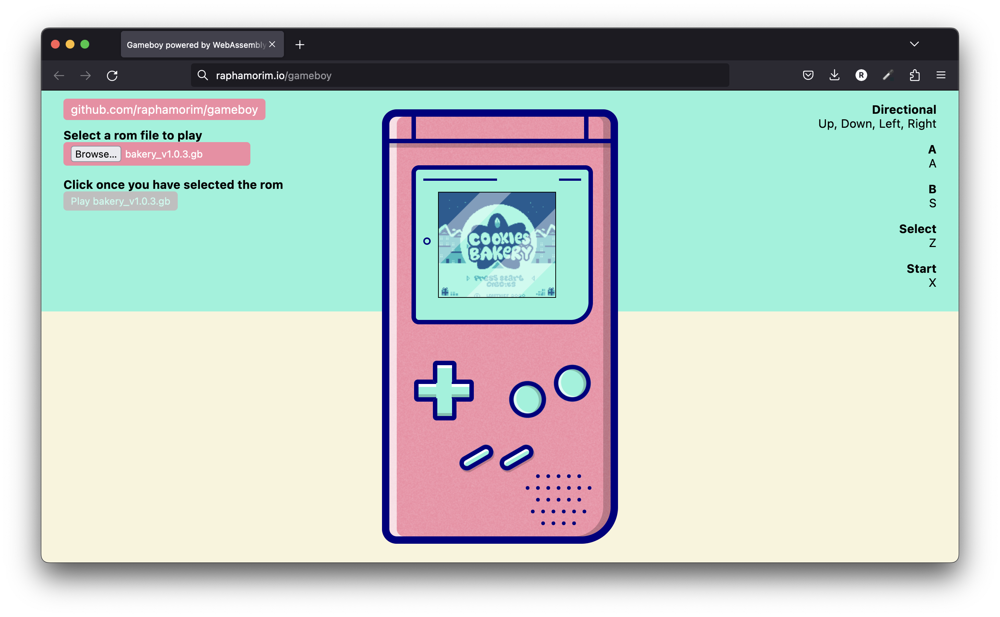
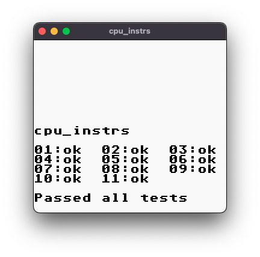
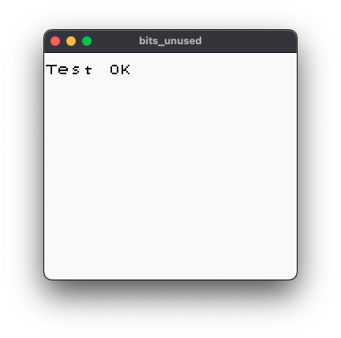
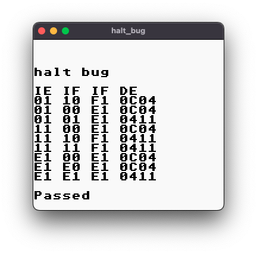
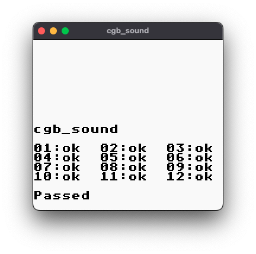
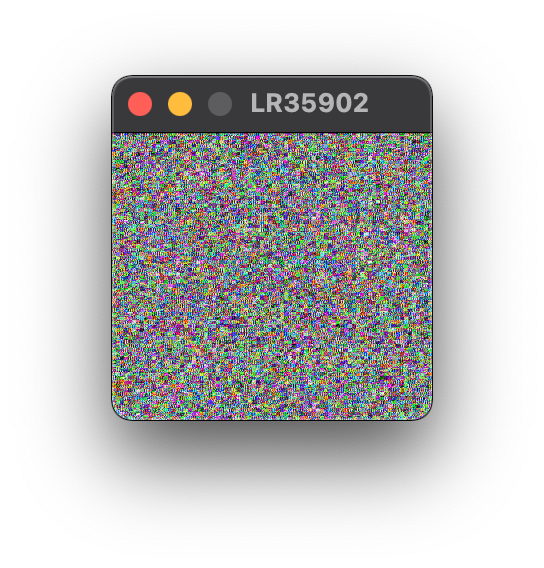
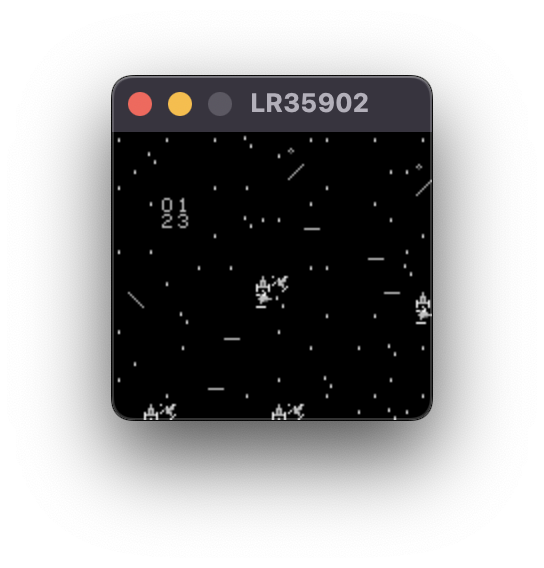
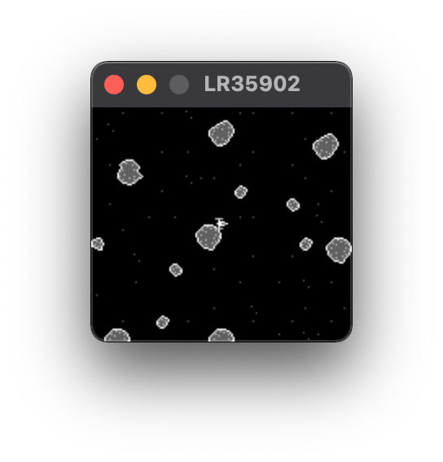

> ### Gameboy emulator written in Rust to WebAssembly
>
> Disclaimer 1.0: This project does not endorse or promote any type of piracy activity. The act of build or install an emulator is not illegal. As many others emulators that have been created over past decades, this *project is just a study case*.
>

| WebGL with WebAssembly | Desktop GUI with Rust |
| --- | --- |
|  |  |
| Firefox 102.0.1 (64-bit) | macOS 11.6.2, 16GB, Quad-Core Intel Core i7, 1,2 GHz |
| `make web` | `make desktop` |

> Disclaimer 1.1: There is a lot of missing features. You can track it by checking the TODO section in the end of the README.md.
>
> Disclaimer 1.2: This project was created using rustc 1.62.1 (e092d0b6b 2022-07-16)
>
> Disclaimer 1.3: Tests need to pass by `ubuntu-20.04`, `macOS-latest` and `windows-latest`
>
> Disclaimer 1.4: Skip to [usage examples](#usage-examples) .
>
> Disclaimer 1.5: The emulator is not 100% done, you can track it development by [Tests](#tests) and [Todo](#todo)
>

## ●&nbsp;&nbsp;Internals


* (c) Jeff Frohwein Source: http://www.devrs.com/gb/hardware.php#hardgb


* A scan of the main logic board for the DMG 01: https://chipmusic.org/forums/topic/13608/dmg-main-board-schematic-circuit-arduinoboy/

## ●&nbsp;&nbsp;Emulators and a bit of Game Boy history...

An emulator typically enables the host system to run software or use peripheral devices designed for the guest system. Emulation refers to the ability of a computer program in an electronic device to emulate (or imitate) another program or device. In the case of the Game Boy most of the work involves dealing with 8-bit buses around (a variant of) the Z80 CPU. The Game Boy CPU is a hybrid between the Intel 8080 and the Zilog Z80. In computing, an emulator is hardware or software that enables one computer system (called the host) to behave like another computer system (called the guest).

About the Z80...


The Z80 is an 8-bit microprocessor introduced by Zilog as the startup company's first product. The Z80 was conceived by Federico Faggin in late 1974 and developed by him and his 11 employees starting in early 1975. The first working samples were delivered in March 1976, and it was officially introduced on the market in July 1976. With the revenue from the Z80, the company built its own chip factories and grew to over a thousand employees over the following two years.

That means manipulating a lot of individual bytes, especially while navigating through huge banks of ROM and RAM. The Game Boy is a pretty simple architecture — getting button input requires reading specific memory addresses, writing pixels to the screen involves pushing bytes to specific places in VRAM.

```
CPU          - 8-bit (Similar to the Z80 processor)
Clock Speed  - 4.194304MHz (4.295454MHz for SGB, max. 8.4MHz for CGB)
Work RAM     - 8K Byte (32K Byte for CGB)
Video RAM    - 8K Byte (16K Byte for CGB)
Screen Size  - 2.6"
Resolution   - 160x144 (20x18 tiles)
Max sprites  - Max 40 per screen, 10 per line
Sprite sizes - 8x8 or 8x16
Palettes     - 1x4 BG, 2x3 OBJ (for CGB: 8x4 BG, 8x3 OBJ)
Colors       - 4 grayshades (32768 colors for CGB)
Horiz Sync   - 9198 KHz (9420 KHz for SGB)
Vert Sync    - 59.73 Hz (61.17 Hz for SGB)
Sound        - 4 channels with stereo sound
Power        - DC6V 0.7W (DC3V 0.7W for GB Pocket, DC3V 0.6W for CGB)
```

* Retired from http://bgb.bircd.org/pandocs.htm

The Game Boy has four operation buttons labeled _"A"_, _"B"_, _"SELECT"_, and _"START"_, and a _directional pad (d-pad)_. There is a volume control dial on the right side of the device and a similar dial on the left side to adjust the contrast. At the top of the Game Boy, a sliding on-off switch and the slot for the Game Boy cartridges are located. The on-off switch includes a physical lockout to prevent users from either inserting or removing a cartridge while the unit is switched on. Nintendo recommends users leave a cartridge in the slot to prevent dust and dirt from entering the system.

```rust
pub enum Input {
    A,
    B,
    Left,
    Right,
    Up,
    Down,
    Start,
    Select,
}
```

The Game Boy contains optional input or output connectors. On the left side of the system is an external 3.5 mm × 1.35 mm DC power supply jack that allows users to use an external rechargeable battery pack or AC adapter (sold separately) instead of four AA batteries. The Game Boy requires 6 V DC of at least 150 mA. A 3.5 mm stereo headphone jack is located on the bottom side of the unit which allows users to listen to the audio with the bundled headphones or external speakers.

The right side of the device offers a port that allows a user to connect to another Game Boy system via a link cable, provided both users are playing games that support connecting to each other (most often, only copies of the same game, although for example, the Pokémon games can connect between different generations). The port can also be used to connect a Game Boy Printer. The link cable was originally designed for players to play head-to-head two-player games such as in Tetris. However, game developer Satoshi Tajiri later used the link cable technology as a method of communication and networking in the popular Pokémon video game series.

Anyway, enough about the Game Boy history.

The Z80 was designed to be binary compatible with the already existing Intel 8080. This means that the instruction set found in the 8080 was also implemented by the Z80 (in essence, the 8080 can be seen as a subset of the Z80). The Game Boy’s custom hybrid chip official name is *Sharp LR35902*.

## ●&nbsp;&nbsp;LR35902 ~ High level architecture

#### CPU (`src/cpu`)

A central processing unit (CPU), also called a central processor, main processor or just processor, is the electronic circuitry that executes instructions comprising a computer program. The CPU performs basic arithmetic, logic, controlling, and input/output (I/O) operations specified by the instructions in the program. This contrasts with external components such as main memory and I/O circuitry, and specialized processors such as graphics processing units (GPUs). 

The Game Boy CPU is composed of 8 different "registers". Registers are responsible for holding on to little pieces of data that the CPU can manipulate when it executes various instructions. The Game Boy's CPU is an 8-Bit CPU, meaning that each of its registers can hold 8 bits (_1 byte_) of data. The CPU has 8 different registers labled as `a`, `b`, `c`, `d`, `e`, `f`, `h`, `l`. 

Each of them is one byte, so each one can hold a value from 0 to 255. An `u8` can do that job for us, since it can store between `0` and `(2^8 - 1)`

$$ u8PossibleValues=(2^8) $$

```rust
assert_eq!(u8::MIN, 0);
assert_eq!(u8::MAX, 255);
```

Example below:

```rust
pub struct Registers {
    pub a: u8,
    pub b: u8,
    pub c: u8,
    pub d: u8,
    pub e: u8,
    pub h: u8,
    pub l: u8
}
```

If there are 256 possible values in the first byte of an instruction, that makes for 256 possible instructions in the basic table. That table is detailed in the Gameboy Z80 opcode map: http://imrannazar.com/Gameboy-Z80-Opcode-Map.

#### Memory (`src/mmu`)


* Image retired from http://imrannazar.com/GameBoy-Emulation-in-JavaScript:-Memory

The Game Boy has a 16-bit address-BUS. Giving an addressable range of `65535 Bytes` (or 64kB). All hardware components
of the Game Boy including RAM, ROM, Video RAM and I /O Ports are memory
mapped as shown below.


* Image retired from http://marc.rawer.de/Gameboy/Docs/GBProject.pdf

##### 64kB

###### Memory map:

- `0x0000` - `0x00FF`: Boot ROM
- `0x0000` - `0x3FFF`: Game ROM Bank 0
- `0x4000` - `0x7FFF`: Game ROM Bank N
- `0x8000` - `0x97FF`: Tile RAM
- `0x9800` - `0x9FFF`: Background Map
- `0xA000` - `0xBFFF`: Cartridge RAM
- `0xC000` - `0xDFFF`: Working RAM
- `0xE000` - `0xFDFF`: Echo RAM
- `0xFE00` - `0xFE9F`: OAM (Object Atribute Memory)
- `0xFEA0` - `0xFEFF`: Unused
- `0xFF00` - `0xFF7F`: I/O Registers
- `0xFF80` - `0xFFFE`: High RAM Area
- `0xFFFF`: Interrupt Enabled Register

More information: https://rylev.github.io/DMG-01/public/book/memory_map.html

You can set the map the initial memory struct with something like this:

```rust
fn power_on(&mut self) {
    self.write_byte(0xFF05, 0);
    self.write_byte(0xFF06, 0);
    self.write_byte(0xFF07, 0);
    self.write_byte(0xFF10, 0x80);
    self.write_byte(0xFF11, 0xBF);
    self.write_byte(0xFF12, 0xF3);
    self.write_byte(0xFF14, 0xBF);
    self.write_byte(0xFF16, 0x3F);
    self.write_byte(0xFF16, 0x3F);
    self.write_byte(0xFF17, 0);
    self.write_byte(0xFF19, 0xBF);
    self.write_byte(0xFF1A, 0x7F);
    self.write_byte(0xFF1B, 0xFF);
    self.write_byte(0xFF1C, 0x9F);
    self.write_byte(0xFF1E, 0xFF);
    self.write_byte(0xFF20, 0xFF);
    self.write_byte(0xFF21, 0);
    self.write_byte(0xFF22, 0);
    self.write_byte(0xFF23, 0xBF);
    self.write_byte(0xFF24, 0x77);
    self.write_byte(0xFF25, 0xF3);
    self.write_byte(0xFF26, 0xF1);
    self.write_byte(0xFF40, 0x91);
    self.write_byte(0xFF42, 0);
    self.write_byte(0xFF43, 0);
    self.write_byte(0xFF45, 0);
    self.write_byte(0xFF47, 0xFC);
    self.write_byte(0xFF48, 0xFF);
    self.write_byte(0xFF49, 0xFF);
    self.write_byte(0xFF4A, 0);
    self.write_byte(0xFF4B, 0);
}
```

#### GPU (`src/gpu`)

The screen resolution of the original Game Boy is 160×144 pixels: 

```rust
pub const WIDTH: usize = 160;
pub const HEIGHT: usize = 144;
```

> https://github.com/raphamorim/LR35902/blob/main/src/gb.rs#L3-L4

# ●&nbsp;&nbsp;Usage examples

## Web ~ JavaScript/WASM usage:

## Desktop ~ Rust usage:

tl;dr: You can see the destop example in the example folder ([`/examples/desktop`](/examples/desktop))

1. Add `lr35902` as dependency and make sure to have `desktop` as feature on:

```toml
[dependencies]
lr35902 = { version = "0.1.0", features = ["desktop"] }
```

2. Import `gameboy` and `renderer::render`:

```rust
use lr35902::gameboy::{Gameboy, RenderMode::Desktop};
```

3. Configure it:

> Default scale is `1` (160x144).

```rust
fn main() {
    let mut gb = Gameboy::new();
    match gb.load_rom("./sample-rom.gb") {
        Ok(..) => {
            gb.render(Desktop);
        }
        Err(err) => {
            println!("{:?}", err);
        }
    }
}
```

# ●&nbsp;&nbsp;TODO

- [x] Desktop
    - [x] Create desktop window
- [x] Browser
    - [x] Create server using port `3000`
- [ ] Keyboard handlers
    - [ ] Web
    - [x] Desktop
- [ ] Classic gameboy instructions (`.gb`)
- [x] Extend screen mod to render on web with WASM
    - [ ] Render with WebGl
- [ ] Support `.cgb` rom (Game Boy Color)
- [ ] `Gameboy::setScale(u8)` for desktop
- [ ] Audio
    - [ ] Desktop
    - [ ] Web
- [ ] Tests for classic Gameboy `/tests`
- [ ] Support `.sgb` rom (Super Game Boy)

# ●&nbsp;&nbsp;Tests

The tests are based on Blargg's Gameboy hardware test ROMs.

Link to the repository: https://github.com/retrio/gb-test-roms.git

| Tests (originally ran in [Openemu](https://openemu.org/)) | Desktop Test | Web Test
| --- | --- | --- |
|  | Passed | Passed |
|  | Passed | Passed |
|  | Passed | Passed |
|  | Passed | Passed |
|  | Passed | Passed |

# ●&nbsp;&nbsp;Development Diary

Tthis section is for personal purposes.

| Diary entry | Screenshot | Notes |
| --- | --- | --- |
| [Sat, 6 August 2022](73c5aded94e466f93c3312633f67097972401f5f) |  | CPU is running but not connected with GPU neither using memory (`MMU`) functions yet. |
| [Sat, 10 August 2022](d42c123aaf1f9632812be0061246bc3335cc71a7) |  | CPU connected with GPU and MMU but using wrong data to plot on screen. Few issues regarding the order of execution on the registers  |
| [Sun, 14 August 2022](9d242d49c3f11703cc8de83b4eb9999ccdbd7308) |  | Operations covered: `0x00, 0xC3, 0x31, 0x3E, 0xE0, 0x97, 0xEA, 0x01, 0xCD, 0x21, 0x16, 0x1E, 0xF0, 0xE6, 0x20, 0xA, 0x22, 0x03, 21, 194, 29, 201, 197, 0x47, 14, 0x09, 193, 68, 77, 213, 25, 209, 0x06, 0x05, 35, 251, 243, 245, 61, 229, 42, 254, 40, 225, 250, 60, 241, 217, 47, 203, 176, 160, 120, 126, 202`. <br/><br/>`0xCD` operations: `0x37, 0x77, 0x7F, 0x6F, 0x67, 0x47, 0x4F` |

# ●&nbsp;&nbsp;Resources & References

- http://bgb.bircd.org/pandocs.htm
- https://github.com/mvdnes/rboy
- https://github.com/alexcrichton/jba/tree/rust
- https://multigesture.net/articles/how-to-write-an-emulator-chip-8-interpreter/
- http://imrannazar.com/GameBoy-Emulation-in-JavaScript:-The-CPU
- http://emubook.emulation64.com/
- https://github.com/jawline/Mimic
- https://www.youtube.com/watch?v=LqcEg3IVziQ
- https://en.wikipedia.org/wiki/Zilog_Z80
- https://en.wikipedia.org/wiki/Game_Boy
- https://medium.com/@andrewimm/writing-a-game-boy-emulator-in-wasm-part-1-1ba023eb2c7c
- https://github.com/yodalee/ruGameboy
- https://www.youtube.com/watch?v=LqcEg3IVziQ
- https://realboyemulator.wordpress.com/2013/01/01/the-nintendo-game-boy-1/
- https://gbdev.gg8.se/wiki/articles/DMG_Schematics
- https://chipmusic.org/forums/topic/13608/dmg-main-board-schematic-circuit-arduinoboy/
- https://github.com/torch2424/wasmboy/
- https://rylev.github.io/DMG-01/public/book/introduction.html
- https://github.com/gbdev/awesome-gbdev
- http://marc.rawer.de/Gameboy/Docs/GBProject.pdf
- https://shonumi.github.io/dandocs.html
- https://github.com/Baekalfen/PyBoy/blob/master/PyBoy.pdf
- https://media.ccc.de/v/rustfest-rome-3-gameboy-emulator
- https://github.com/rylev/DMG-01
- https://gbdev.gg8.se/wiki/articles/Gameboy_Bootstrap_ROM
